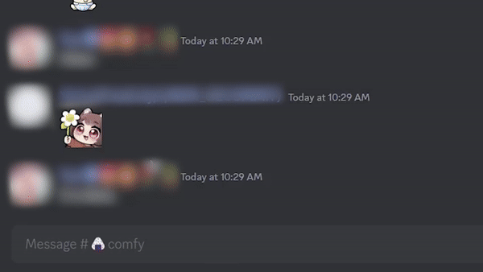

# Stemoji


This is an open source discord bot that allows you to use customize emojis that you put in the bot. It utilizes
the new application emoji features that supports up to 2000 custom emojis! It is lightweight and simple to 
set up.

## Bot Feature
### Steal emojis
  

Features includes:
  - Steal emoji from messages contents and reactions
  - Steal server emojis (when bot are added in the server)

### Emoji Usage
|               Simple                |              Texting Mode               |
|:-----------------------------------:|:---------------------------------------:|
|  |  | 
|              **Fast**               |             **Searchable**              |
|      |      | 

Other features includes:
- Listing out all emojis
- Emoji management
  - Adding, Renaming, Deleting
  - Setting favourite emojis
- Reacting with custom emojis

### For use
- Available on Direct Messages by user installs
- Available for use in servers that allows external application installs.

## Self-host Configuration
<details>
<summary>4 Steps to host your own stemoji bot.</summary>

### Clone the repository
```
git clone https://github.com/InterStella0/stemoji
```
### Python
Install Python 3.11 or above.
Then install python dependencies below.
```commandline
pip install -r requirements.txt
```

### Configure Bot
1. Rename **default.env** to **.env**.
2. Go to [discord api portal](https://discord.com/developers/applications).
3. New Application > [insert your bot's name] > Bot > Reset Token > Copy Token
4. Set your bot's token at **BOT_TOKEN=""**.

The full environment variable description are written on [Environment variable](#environment-variable) section.

### Run the bot!
```commandline
python main.py
```

### Install the bot on discord
1. Discord Developer Portal > Installation > Select User Install > Copy User Install Link
2. Click on the install link
3. Click Try It Now
4. Restart your discord client

### Done!
Your bot should be fully configured! Any errors must be solve yourself or you can
open an issue if you believe it's a bug.

## Nerdge Section
### Environment variable
The description for each environment variable are described below.

|          VARIABLE           |  TYPE   | DEFAULT  |                                       DESCRIPTION                                       |
|:---------------------------:|:-------:|:--------:|:---------------------------------------------------------------------------------------:|
|          BOT_TOKEN          | String  |          |                      Get it from discord API portal. **REQUIRED**                       |
|     TEXT_COMMAND_PREFIX     | String  | stemoji  |                     This will be the prefix for your text commands.                     |
| TEXT_COMMAND_PREFIX_MENTION | Boolean |   TRUE   |                  This will allow text commands to be used by mentions.                  |
|   MESSAGE_CONTENT_INTENTS   | Boolean |  FALSE   |                      It allows prefix commands to work everywhere.                      |
|       MEMBERS_INTENTS       | Boolean |  FALSE   |               Allows your bot to have better profile mirroring experience               |
|          DATABASE           | String  |  sqlite  |                     Database choice, use 'sqlite' for simple setup.                     |
|        DATABASE_DSN         | String  | emoji.db |                               Database connection string.                               |
|         OWNER_ONLY          | Boolean |  FALSE   |                       Disallow other people from using your bot.                        |
|       MIRROR_PROFILE        | Boolean |  FALSE   |            Uses your profile picture and display name as the bot's profile.             |
|       RETAIN_PROFILE        | Boolean |   TRUE   | Recover your bot's profile during shutdown. **Only relevant if MIRROR_PROFILE is TRUE*. |
|       BOT_NAME_SUFFIX       | String  |   bot    |    Add a name suffix on your bot's name **Only relevant if MIRROR_PROFILE is TRUE*.     |
</details>